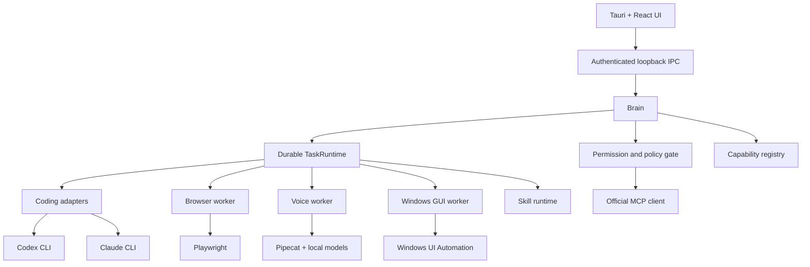

# H.A.L.O. Phase 3 Production System Design

Status: Approved architecture baseline

Owner: H.A.L.O. maintainers

Last updated: 2026-08-03

Scope: Phase 3.0–3f architecture for a durable, cost-efficient, publicly cloneable Windows desktop application.

## Abstract

Phase 3 extends the implemented H.A.L.O. core with coding orchestration, MCP integrations, browser automation, real voice, Windows GUI control, and governed self-improvement. The selected architecture is a thin core plus capability packs. The Brain, permission gate, TaskRuntime, SQLite state, and authenticated IPC contract remain authoritative. Optional workers and direct adapters add capabilities without introducing a second orchestrator, permission system, memory store, or workflow database.

Production-ready means that an unfamiliar contributor can clone, bootstrap, verify, and run H.A.L.O. from documented commands; packaged releases do not require a developer Python installation; missing optional capabilities degrade honestly; and upgrades preserve user state. Project licensing is intentionally deferred to the Phase 3f public-release gate.

## Goals

- Preserve text chat and the implemented Phase 0–2 guarantees while adding Phase 3 capabilities incrementally.
- Make every long-running or side-effecting operation durable, bounded, observable, and approval-aware.
- Keep the default installation and idle resource footprint small.
- Provide reproducible source builds, sidecar packaging, dependency locking, SBOM generation, and clean-machine verification.
- Make capability availability and recovery state truthful in the UI.
- Meet WCAG 2.2 AA, keyboard, NVDA, reduced-motion, and compact-window requirements.

## Non-goals

- Cross-platform GUI automation in Phase 3; Windows is the supported desktop target.
- Automatic replay of torn side-effecting tasks.
- Hidden attachment to a user's normal Chrome profile.
- Automatic activation of generated skills.
- Replacing TaskRuntime with OpenHands, Browser Use, Agent-S, Magentic-UI, Celery, or another orchestrator.
- A hosted H.A.L.O. control plane or mandatory telemetry service.

## Current-state problems

The Phase 0–2 core is mature enough to host Phase 3, but the repository is not yet clone-to-green for a new contributor. Python workers have separate hashed installations, Voice needs an editable Brain installation, Tauri still launches source modules, and the repository has no root onboarding document. The current UI documentation also overstates restart recovery: TaskRuntime reconciles torn tasks truthfully and never blindly replays arbitrary side effects.

Phase 3 dependencies can become much larger than the core. Browser frameworks commonly bundle multiple model SDKs and telemetry clients; real-time voice pulls native audio, inference, and model assets; GUI vision can introduce GPU and model requirements. Bundling all of that into the Brain would increase installer size, cold start, CI cost, vulnerability surface, and PyInstaller risk.

## Design invariant

The Brain is the only orchestrator. Every external action passes through its deterministic permission gate. Every task-shaped capability uses TaskRuntime. Capability workers own execution mechanics, not product policy or durable truth.

## Architecture

### Core components

| Component | Responsibility | Durable source | Failure behavior |
|---|---|---|---|
| Brain and gate | Intent, policy, approvals, model routing, task admission | SQLite, keyring, LangGraph checkpoints | Fail closed for mutations; chat remains available when optional packs fail |
| TaskRuntime | Bounded task execution, progress, logs, stop/pause and restart reconciliation | SQLite task and activity records | Torn work becomes interrupted or failed; never auto-replay effects |
| Capability registry | Installation, version, health, operations, repair actions and permission classes | Versioned capability records plus manifests | Unknown or incompatible packs are unavailable and cannot admit tasks |
| Adapters and workers | Translate stable Halo operations to CLIs, Playwright, audio, UIA and MCP | External session IDs and worker-specific checkpoints only | Timeout/stop is correlated; worker failure is isolated |
| UI projection | Truthful capability, task, budget, approval and recovery state | Brain frames; bounded volatile stream tails | Stale/unknown state disables consequential controls and exposes repair |

## Capability registry

Each capability has a stable ID, semantic version, manifest version, state, installed components, health timestamp, supported operations, permission classes, configuration issues, and install/repair/remove actions. States are `not_installed`, `installing`, `available`, `misconfigured`, `busy`, `degraded`, `unhealthy`, and `update_required`.

Manifests are declarative data. They do not receive authority to run arbitrary installation scripts. Source installs use locked workspace extras; packaged installs use versioned maintainer-built packs whose integrity is verified before execution.

## Task and recovery contract

Phase 3 tasks persist the provider/worker type, external session identifier when one exists, project/worktree or browser-profile identity, last acknowledged event sequence, last durable checkpoint, capability version, resume support, budgets, and terminal/recovery reason.

On restart, Halo probes the recorded worker/session. It resumes only through an adapter's verified resume mechanism. Otherwise it records `interrupted_after_restart` and offers explicit retry-from-checkpoint or start-over actions. A new attempt has a new attempt ID and remains linked to the original task for audit. Side-effecting steps are never replayed from inference alone.

Configuration and capability versions are snapshotted at task admission. Mid-task updates apply only to new attempts unless an explicit safe migration exists.

## Capability decisions

### Coding orchestration

Implement one provider-neutral adapter protocol with discovery, capability probing, structured command construction, structured event parsing, stop, reconciliation, and verified resume. Codex and Claude are the first adapters. Consume their JSON/JSONL modes rather than terminal prose. Store changed files, test results, approvals, usage and the final outcome separately from bounded raw logs. Git stage, commit, push and destructive cleanup remain explicit user actions.

### MCP and integrations

Use the official Python MCP SDK directly, pinned to the stable major line. Support stdio and authenticated HTTP transports. Registration is explicit; imported tools are snapshotted and classified as read-only, local mutation, external mutation, or destructive. Tool descriptions and results are untrusted external content. Do not add a LangChain MCP adapter.

### Browser automation

Use raw Playwright with a dedicated H.A.L.O. browser profile. Users sign into that profile themselves; Halo never copies or silently attaches to the default Chrome profile. Planning stays in the Brain; deterministic browser operations live in the worker. Purchases, publishing, credential changes and comparable consequences require approval. Screenshots and page state have bounded retention.

### Voice

Push-to-talk is the reliable default. Pipecat coordinates local faster-whisper STT and Kokoro TTS in the Voice pack. Models download lazily with visible size, integrity, progress and removal controls. Cloud STT/TTS is an optional fallback. Wake word is opt-in until a H.A.L.O.-specific model passes false-trigger and missed-trigger targets. Voice failure cannot disable text chat.

### Windows GUI control

Use targeted Windows UI Automation first and avoid repeated full-desktop accessibility-tree enumeration. Physical input immediately pauses autonomous control. Vision grounding is a separately enabled fallback after deterministic UIA is proven. Per-client `stream_frame` subscription is a just-in-time prerequisite for this phase.

### Skills and self-improvement

Continue the portable `SKILL.md` format. The governed lifecycle is draft, evaluation, trial, active, and retired. Generated skills never activate automatically. Persist origin, evaluation evidence, required permissions, dependencies and rollback information. Bundled scripts use the ordinary gate and TaskRuntime.

## Dependency plan

Adopt a root `uv` workspace with a universal checked-in lock. Brain, Voice, browser, Windows GUI, integrations, and build tools remain separately addressable packages. Production sidecars are built from only their required dependency sets. The current hashed requirements files remain until the workspace lock passes CI parity and clean-machine reproduction.

Add the official MCP SDK, Playwright, isolated Voice dependencies, one benchmark-selected UIA binding, and PyInstaller build tooling. Do not add Browser Use, OpenHands, Agent-S, Magentic-UI, a LangChain MCP adapter, or a second task queue as core runtime dependencies.

Playwright browser binaries and local speech models are versioned artifacts rather than implicit package-manager side effects. Every new dependency must pass maintenance, license-compatibility, vulnerability, native-wheel, installer-size, cold-start, optionality, and removal review. The final project-license compatibility review remains a Phase 3f gate.

## Request lifecycle

1. UI submits a typed request with conversation, capability, target, intent and budgets.
2. Brain validates the IPC envelope, caller authorization, manifest compatibility and capability health.
3. The gate resolves lane, approval requirements, untrusted-input boundaries and redaction rules.
4. TaskRuntime durably records intent, configuration snapshot and attempt before execution.
5. The adapter or worker emits ordered structured events; bounded raw streams are secondary evidence.
6. Retries obey per-operation idempotency, time, call and spend budgets. Consequential actions stop for approval.
7. Brain durably records outcome and activity, then projects correlated task, spend and capability frames to subscribed clients.

## Primary capability manifest fields

| Field | Type | Required | Meaning |
|---|---|---:|---|
| `capability_id` | string | yes | Stable globally unique capability identity |
| `manifest_version` | integer | yes | Parser/contract compatibility version |
| `capability_version` | semver | yes | Installed implementation version |
| `state` | enum | yes | Brain-owned operational state |
| `operations` | array | yes | Stable operation IDs and schemas |
| `permission_classes` | map | yes | Gate classification per operation |
| `runtime` | object | yes | Worker entry point, protocol and health probe |
| `artifacts` | array | no | Browser/model/binary versions, sizes and integrity hashes |

The canonical cross-process contract remains the hand-mirrored `CONTRACT_SPEC` definitions in Brain and UI, checked by `shared/check_contract_sync.py`; there is no JSON schema source of truth. Domain fields must not reuse the envelope `id` key.

## Consistency and failure behavior

| Scenario | Expected behavior | Safety basis |
|---|---|---|
| Duplicate user request or worker event | Correlation and event sequence deduplicate stable transitions | Prevents duplicate state changes while retaining audit evidence |
| Required durable write fails | Do not begin downstream side effects; return a correlated retryable error | Intent exists before effect or no effect occurs |
| Worker timeout or partial failure | Cooperative stop, bounded retry where operation is idempotent, then explicit terminal/interrupted state | Budgets bound cost and attempts remain reconstructable |
| Capability/configuration changes mid-task | Admitted snapshot remains authoritative | Prevents behavior drift inside one attempt |

## Security and privacy

- Preserve the authenticated random-port loopback handshake and fresh `session.json` reread on every reconnect.
- Apply the deterministic gate to every CLI, MCP, browser, voice, GUI and skill action.
- Treat web pages, files, tool descriptions, tool results, transcripts and GUI text as untrusted data rather than policy.
- Store secrets only in the OS keystore; never place credentials in manifests, logs, diagnostics, prompts or repository examples.
- Use dedicated browser profiles, bounded screenshot/audio retention, redacted diagnostic exports and local telemetry disabled by default.
- Unknown capabilities, incompatible manifests, missing integrity metadata and unsafe migrations fail closed.
- Signed releases and pack verification are maintainer release concerns; signing private keys never enter the repository.

## Cost controls

- Stable non-sensitive OpenRouter `session_id` values per conversation/task to improve provider stickiness and prompt-cache reuse.
- Relevant tool schemas only; load large capability instructions on demand.
- Light-model routing for classification, summaries and deterministic preparation.
- Task budgets for tokens, spend, wall time, retries and external calls, with approval required for escalation.
- Lazy model downloads and unload-on-idle Voice behavior.
- Start browser and GUI workers on demand and stop them after bounded idle time.
- No mandatory hosted telemetry or server infrastructure.

## UI and accessibility

First run provides a System Check for operating system support, developer prerequisites, worker health, API keys, coding CLIs, browser assets, Voice models and repair steps. Settings exposes each pack's installed version, size, privacy impact, required external software, health and install/repair/disable/remove actions.

Task details show capability, phase, target, approvals, budgets, structured changes/results, bounded logs and recovery choices. `interrupted_after_restart` is distinct from failed, paused and resumable. Coding uses phase/diff/test views; Browser and GUI identify the controlled site/application and ownership; Voice always exposes microphone/listening/speaking state.

All Phase 3 surfaces target WCAG 2.2 AA, keyboard parity, NVDA live-region announcements, non-color state indicators, reduced motion/transparency, critical-action target sizing and compact one-column layouts. Confirmable controls keep the existing lock-on-press/unlock-on-correlated-confirmation behavior.

## Operational readiness and release gates

- Clean Windows x64 clone can bootstrap, run and pass the full gate from documented commands.
- Packaged builds run without a developer Python installation.
- Missing optional packs do not disable chat or corrupt navigation.
- Contract sync, DB migrations, sidecar crash/restart, task reconciliation and pack incompatibility have automated checks.
- Native flows cover install, repair, upgrade, uninstall, real-key model use, browser profile setup, microphone behavior, physical-input pause and NVDA.
- CI generates dependency audit results, SBOM and third-party notices from locked graphs.
- No release proceeds with unresolved high-severity vulnerabilities, secret findings, broken rollback, or false recovery claims.

Rollout is tranche-gated. Each capability starts behind an availability flag, passes offline fixtures, then native maintainer validation, then a documented public beta. The text-chat path is a regression gate for every tranche.

## Alternatives considered

1. A batteries-included monolith simplifies one installer but increases default size, cold start, CI cost, native dependency conflicts and PyInstaller risk.
2. Framework-led assembly accelerates prototypes but duplicates H.A.L.O.'s orchestrator, gate, memory and task runtime while importing broad model/telemetry graphs.
3. Hosted capability services simplify local packaging but contradict local-first operation, add recurring infrastructure cost and create a new privacy boundary.
4. Automatic torn-task replay appears convenient but cannot safely infer whether arbitrary external side effects already occurred.

## Open questions deferred to phase gates

- Select the final project license before public release and re-run the dependency redistribution review.
- Decide whether Windows ARM64 is a Phase 3f release target after x64 packaging and native dependency evidence exist.
- Choose the UIA binding after a benchmark against target Windows applications.
- Decide the official updater channel and signing custody before enabling production updates.

## Phase sequence

### Phase 3.0 — open-source foundation

Create root onboarding and bootstrap, migrate toward the `uv` workspace, add the capability registry and dependency admission gate, implement redacted diagnostics, prove packaged sidecar discovery, and correct stale contract/recovery documentation.

Exit: a clean Windows x64 checkout reaches a working text-chat app and full repository gate through documented commands; capability absence is rendered truthfully.

### Phase 3a — coding orchestration

Implement the neutral adapter, Codex and Claude adapters, structured events, verified-resume metadata, coding task UI, offline fixtures and native CLI checks.

Exit: an interrupted coding task either resumes through a verified provider session or becomes truthfully interrupted; changed files/tests/usage are reconstructable.

### Phase 3b — MCP and browser automation

Implement MCP registration/classification, Playwright worker, dedicated browser profile, browser approvals, bounded artifacts and responsive accessible task UI.

Exit: registered integrations and browser tasks are permission-gated, recover safely and never use a default browser profile implicitly.

### Phase 3c — packaging and real Voice

Freeze Brain and Voice sidecars, package with Tauri NSIS, test source/packaged path selection, add push-to-talk, local STT/TTS, lazy models and optional wake word.

Exit: installer works without Python, text remains available during Voice failure, and local audio passes privacy/accessibility checks.

### Phase 3d — Windows GUI control

Add per-client stream subscription, targeted UIA, physical-input pause, takeover UI, approvals and only then optional vision fallback.

Exit: deterministic GUI flows pass native tests, user input always interrupts control, and streamed frames reach only subscribed clients.

### Phase 3e — governed self-improvement

Add draft/evaluation/trial/active/retired skill lifecycle, provenance, eval evidence, permission manifests, rollback and portable import/export.

Exit: no generated skill can activate or gain authority without explicit approval and evaluation evidence.

### Phase 3f — public-release hardening

Validate clean clone and installer lifecycle, migrations and rollback, SBOM/notices, signing/updater design, contributor/security/support documentation, license and redistribution compatibility.

Exit: all public-release gates pass on a clean Windows x64 environment with no machine-specific paths or credentials.

## Current-source references

- [Playwright Python](https://playwright.dev/python/docs/intro)
- [MCP Python SDK](https://github.com/modelcontextprotocol/python-sdk)
- [Pipecat](https://github.com/pipecat-ai/pipecat)
- [Codex](https://github.com/openai/codex)
- [Claude Code CLI](https://docs.anthropic.com/en/docs/claude-code/cli-reference)
- [PyInstaller](https://pyinstaller.org/en/stable/)
- [Tauri Windows installer guidance](https://v2.tauri.app/distribute/windows-installer/)
- [uv workspaces](https://docs.astral.sh/uv/concepts/projects/workspaces/)
- [OpenRouter prompt caching](https://openrouter.ai/docs/guides/best-practices/prompt-caching)
